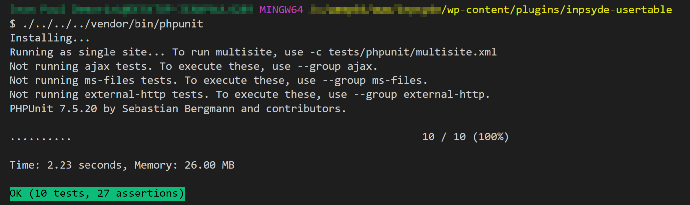
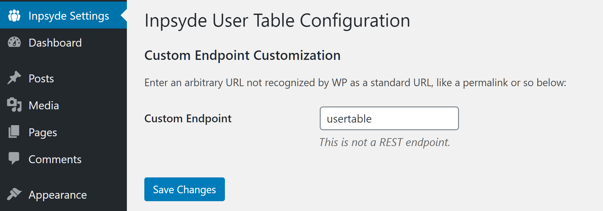
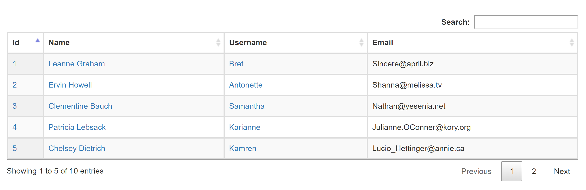

[](https://www.gnu.org/licenses/old-licenses/gpl-3.0.en.html)  

# Inpsyde User Table
**Tags:** Inpsyde, User Table

**License:** GPLv3 or later

**License URI:** http://www.gnu.org/licenses/gpl-3.0.html

Make available a custom endpoint on the WordPress site. With “custom endpoint” we mean an arbitrary URL not recognized by WP as a standard URL, like a permalink or so.

### Description

The plugin will make available a custom endpoint in the Wordpress Site, that custom endpoint will show a table with a list of users coming from an external API (_http://jsonplaceholder.typicode.com/users/_).

When a user is clicked a dialog will display showing the selected user details.

The default endpoint is http://YOURDOMAIN.COM/usertable where **YOURDOMAIN** is your site domain name.

You can also:
  - Edit the default endpoint in the WordPress Admin Panel by going to the option "Inpsyde Settings" showing in the left sidebar.


### Tech

* [jQuery] - JavaScript Library which greatly simplifies JavaScript programming.
* [jQuery Datatable]  is a plug-in for the jQuery Javascript library that adds advanced interaction controls to your HTML tables.
* [Ajax] - AJAX allows web pages to be updated asynchronously by exchanging data with a web server behind the scenes.
* [PHPUnit] - A programmer-oriented testing framework for PHP.

## Installation
Assuming you are in the root installation of your WordPress Site, add the following code to the composer.json
```json
"extra": {
    "installer_paths": {
        "wp-content/plugins/{$name}/": ["type:wordpress-plugin"]
    }
}
```

Install with [Composer](https://getcomposer.org):
```sh
$ composer config github-oauth.github.com eef8db8a79dd3fd91ec8b4f32e858e7b2b17bae7  
$ composer require jeanpaul4289/inpsyde-usertable:1.0.7
$ composer require --dev phpunit/phpunit ^7
```
### Testing
Assuming you are in the root installation of your WordPress Site, and the **vendor* folder is in the root folder, run the following command in order to test:

```sh
$ cd wp-content/plugins/inpsyde-usertable
$ ./../../../vendor/bin/phpunit
```


### Requirements

* WordPress 5.4.
* PHP 7.2 or higher.
* PHPUnit 7.5 _(refrain from using a higher versions)_.

## Screenshots




### License
----

GNU GPL v3

   [jQuery Datatable]: <https://datatables.net/>
   [jQuery]: <http://jquery.com>
   [ajax]: <https://api.jquery.com/jquery.ajax/>
   [PHPUnit]: <https://phpunit.de/>
